# Reference Authentication Flow with Flutter & GetX

## Project goals

This project shows how to:

- UI Flow login with via phone, email and google, facebook
- build a robust authentication flow
- use appropriate state management techniques to separate UI, logic and
- handle errors and present user-friendly error messages
- write production-ready code following best practices
- use getX state management

Feel free to use this in your own projects. 😉

_NOTE: This project will be kept up to date with the latest packages and Flutter version._

## Preview

| currentProfile                | Login                       | loginForm                    | notification setting               | phone onput               | profileTab                |
| ----------------------------- | --------------------------- | ---------------------------- | ---------------------------------- | ------------------------- | ------------------------- |
| 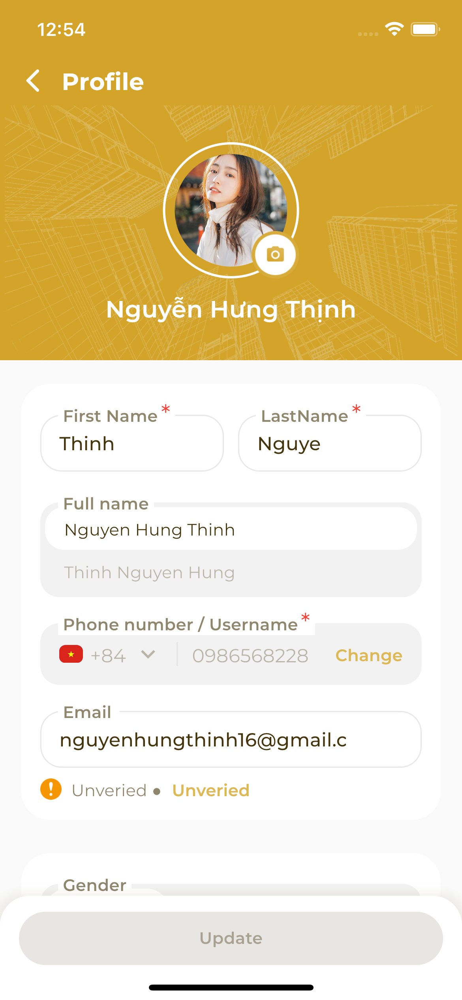 | 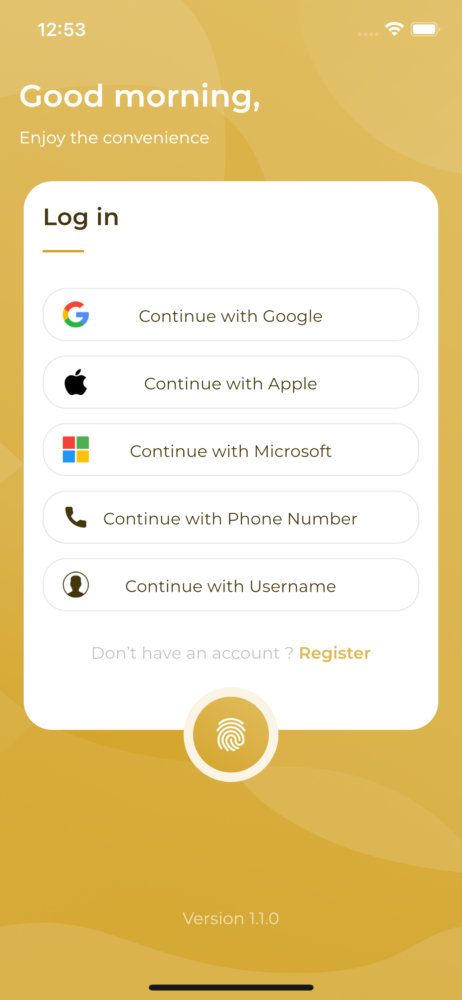        | 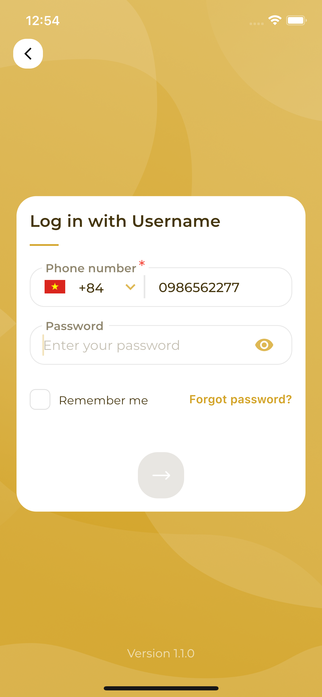     | 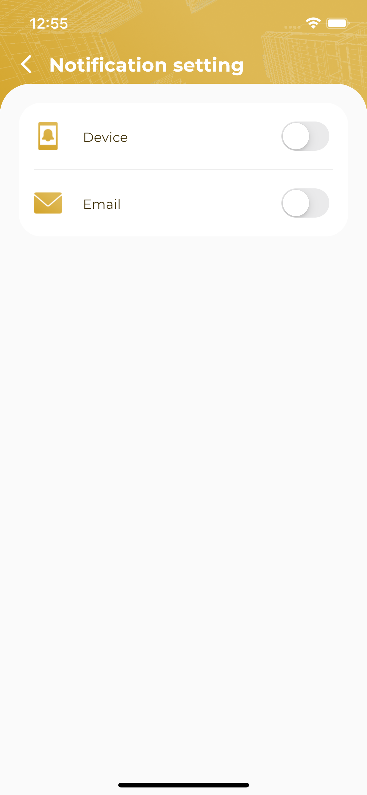 | 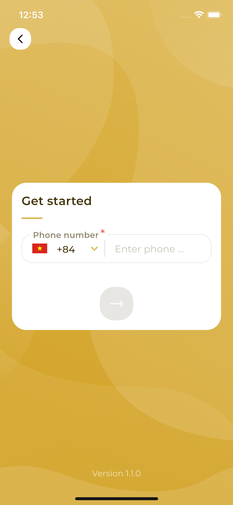 | 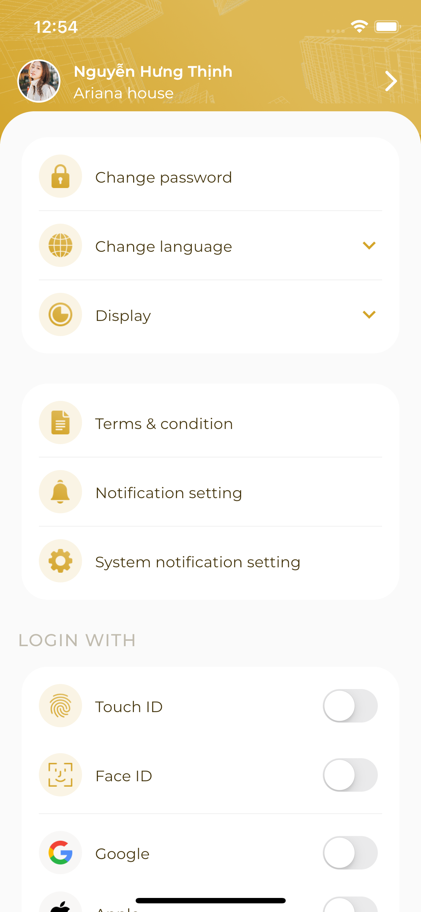 |
| register                      | register Form               | reset password               | term                               | verifyCode                |                           |
| 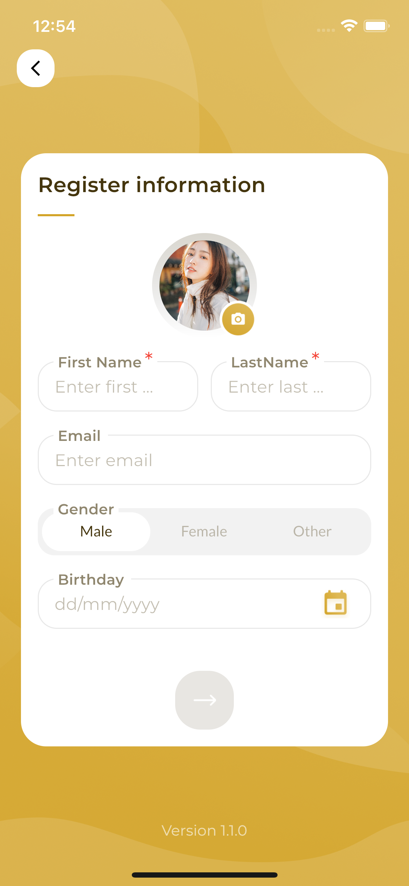       | 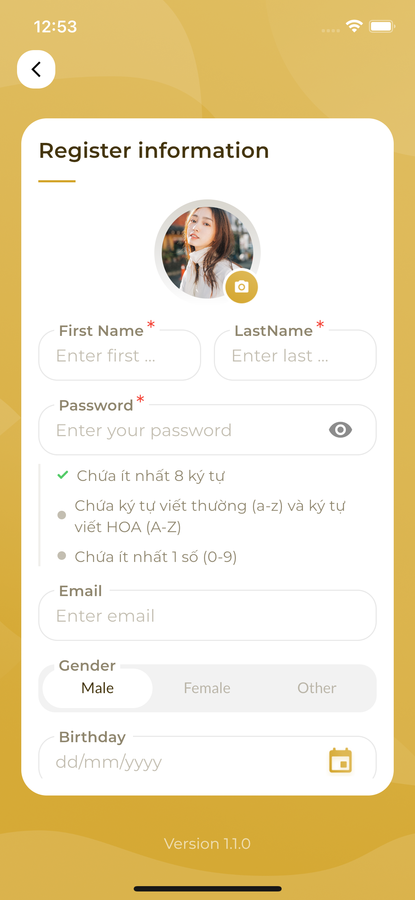 | 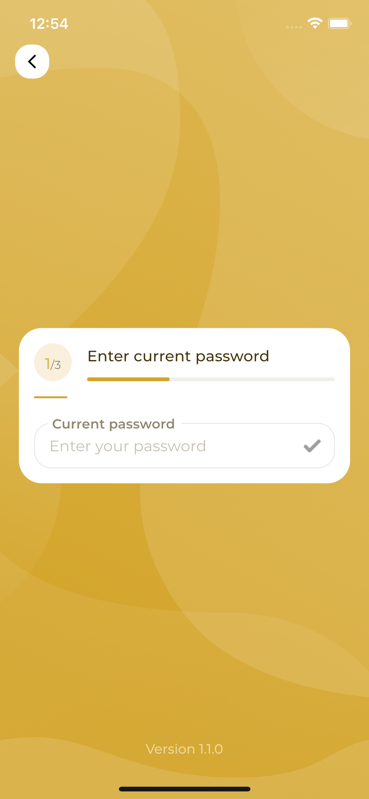 | 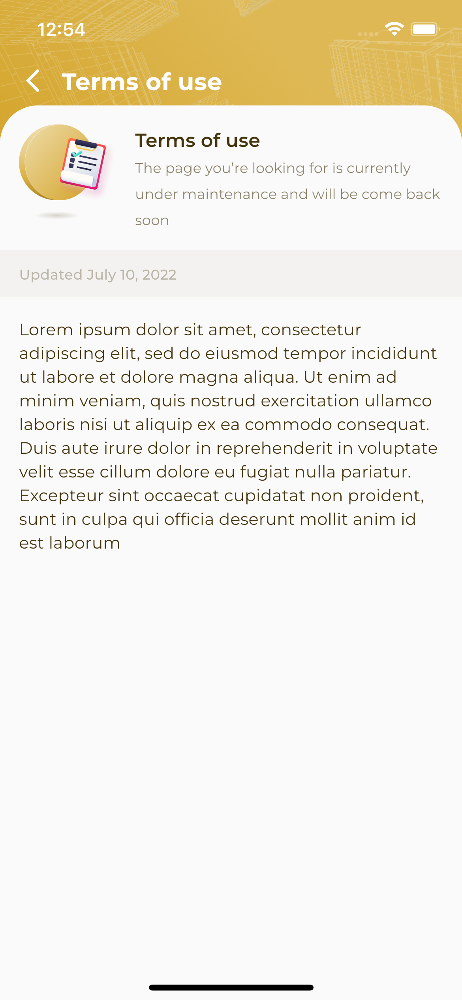                |        | 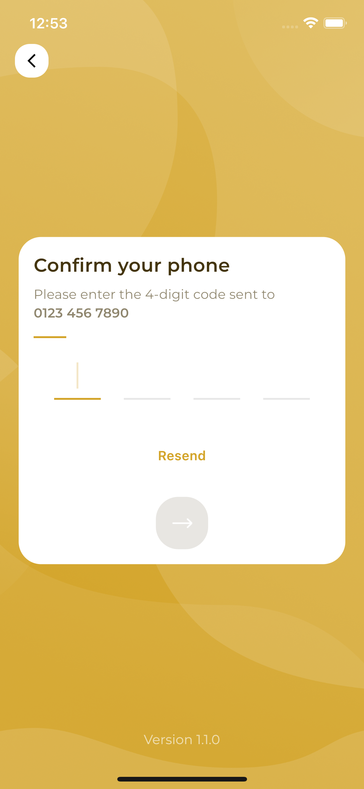 |

## Running the project

- Clone project with link
- Run project "Flutter pub get" and "Flutter run" and select one of the list devices show below

## [License: MIT](LICENSE.md)
